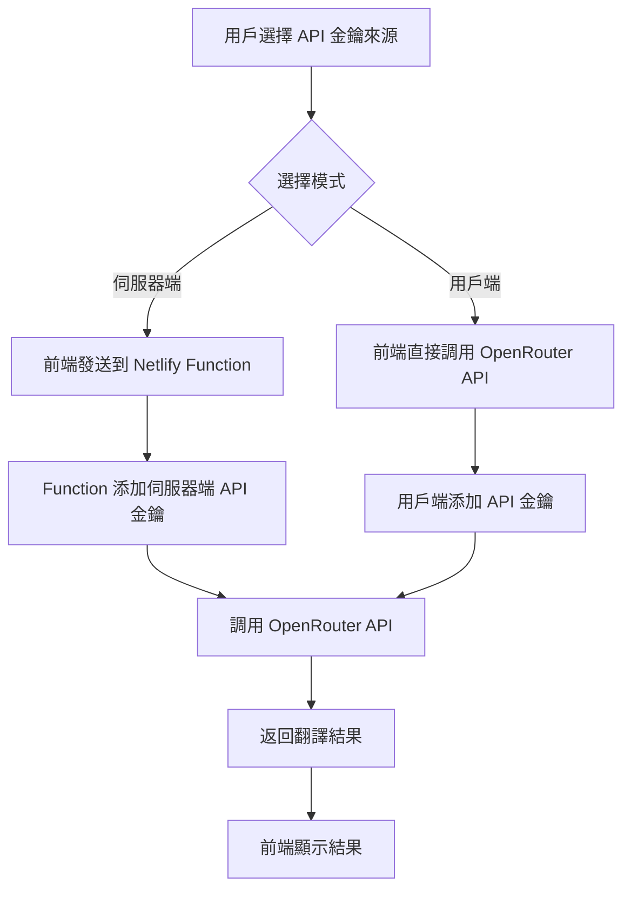

# Kilo 即時語音翻譯器 - Netlify 部署指南

## 🔒 雙重 API 金鑰模式的 Netlify Functions 版本

這個版本提供雙重 API 金鑰模式：
1. **伺服器端模式**：使用 Netlify Functions 安全地處理 OpenRouter API 調用，確保 API 金鑰不會暴露給前端
2. **用戶端模式**：允許用戶自行輸入 API 金鑰，直接調用 OpenRouter API

這種設計既提供了企業級安全性，又給予用戶靈活的使用選擇。

## 📁 檔案結構

```
kilo-translator/
├── index.html              # 主應用程式
├── netlify/
│   └── functions/
│       └── translate.js  # 伺服器端翻譯函數
├── netlify.toml           # Netlify 配置檔案
├── package.json           # Node.js 依賴
└── README.md             # 專案文檔
```

## 🚀 部署步驟

### 1. 準備檔案

確保所有檔案都在您的專案目錄中：
- `index.html`
- `netlify/functions/translate.js`
- `netlify.toml`
- `package.json`

### 2. 設置 Netlify

#### 方法一：拖拽部署（最簡單）

1. 訪問 [Netlify](https://app.netlify.com/drop)
2. 將整個專案資料夾拖拽到部署區域
3. 等待部署完成

#### 方法二：Git 部署

1. 將檔案推送到 GitHub 儲存庫：
   ```bash
   git init
   git add .
   git commit -m "Initial commit"
   git remote add origin https://github.com/yourusername/kilo-translator.git
   git push -u origin main
   ```

2. 在 Netlify 中：
   - 點擊 "New site from Git"
   - 選擇 GitHub
   - 授權並選擇您的儲存庫
   - 配置部署設定

### 3. 設置環境變數（重要！）

在 Netlify 控制台中設置環境變數以支援伺服器端 API 金鑰模式：

1. 進入您的網站控制台
2. 點擊 "Site settings" > "Build & deploy" > "Environment"
3. 添加以下環境變數：

   **變數名稱**: `OPENROUTER_API_KEY`
   **值**: 您的實際 OpenRouter API 金鑰
   **狀態**: 勾選 "Deploy context"

#### 🔄 雙重模式說明

部署完成後，用戶可以在應用程式中選擇：

1. **伺服器端 API 金鑰模式**（預設）
   - 使用您在 Netlify 環境變數中設置的 API 金鑰
   - API 金鑰完全安全，不會暴露給用戶
   - 適合一般用戶和企業內部使用

2. **用戶端 API 金鑰模式**
   - 用戶可以自行輸入自己的 OpenRouter API 金鑰
   - 金鑰僅存儲在用戶瀏覽器本地，不會上傳到伺服器
   - 適合高級用戶和需要大量使用的場景

### 4. 驗證部署

部署完成後：

1. 訪問您的網站 URL
2. 檢查瀏覽器控制台沒有錯誤
3. 嘗試進行翻譯測試

## 🔧 技術架構

### 雙重 API 金鑰模式流程



### 安全優勢

#### 伺服器端模式
- ✅ **API 金鑰保護**：金鑰存儲在伺服器端，完全不暴露給前端
- ✅ **請求控制**：可以添加使用限制和監控
- ✅ **錯誤處理**：統一的錯誤處理和日誌記錄
- ✅ **CORS 支援**：跨域請求安全處理
- ✅ **成本控制**：管理員可以統一控制 API 使用成本

#### 用戶端模式
- ✅ **用戶自主性**：用戶可以使用自己的 API 配額
- ✅ **靈活性**：支援任何 OpenRouter 模型
- ✅ **本地安全**：API 金鑰僅存儲在用戶瀏覽器中
- ✅ **無伺服器依賴**：減少伺服器負載和成本

#### 整體優勢
- 🔄 **靈活切換**：用戶可以隨時切換模式
- 🛡️ **多重保障**：兩種模式都有相應的安全措施
- 📊 **使用統計**：可以分別統計兩種模式的使用情況

## ️ 本地開發

### 安裝 Netlify CLI

```bash
# 全局安裝
npm install -g netlify-cli

# 或者在專案中安裝
npm install --save-dev netlify-cli
```

### 本地運行

```bash
# 啟動本地開發伺服器
netlify dev

# 這會啟動 Functions 服務器和前端服務器
# 訪問 http://localhost:8888
```

### 設置本地環境變數

創建 `.env` 檔案：
```
OPENROUTER_API_KEY=your_actual_api_key_here
```

## 📊 監控和日誌

### 查看 Functions 日誌

1. 進入 Netlify 控制台
2. 點擊 "Functions" 標籤
3. 查看實時日誌和錯誤信息

### 性能監控

Netlify 提供：
- Functions 執行時間
- 請求數量統計
- 錯誤率監控
- 帶寬使用情況

## 🔒 安全最佳實踐

### 伺服器端 API 金鑰管理

1. **定期輪換**：定期更換 Netlify 環境變數中的 API 金鑰
2. **最小權限**：只給予必要的權限
3. **監控使用**：定期檢查 API 使用情況和 Functions 日誌
4. **備份計劃**：制定 API 金鑰洩露應對計劃

### 用戶端 API 金鑰安全

1. **本地存儲**：API 金鑰僅存儲在瀏覽器 localStorage 中
2. **HTTPS 傳輸**：確保所有 API 請求都通過 HTTPS
3. **用戶教育**：提醒用戶不要分享自己的 API 金鑰
4. **輸入驗證**：驗證 API 金鑰格式的正確性

### 網路安全

- HTTPS 強制加密
- 安全標頭設置
- CORS 政策配置
- 請求驗證

## 🚨 故障排除

### 常見問題

1. **Function 部署失敗**
   - 檢查 `netlify.toml` 配置
   - 確認 `package.json` 依賴
   - 查看 Functions 日誌

2. **伺服器端 API 調用失敗**
   - 驗證 Netlify 環境變數設置
   - 檢查伺服器端 API 金鑰有效性
   - 確認 OpenRouter 服務狀態
   - 查看 Functions 日誌

3. **用戶端 API 調用失敗**
   - 檢查用戶輸入的 API 金鑰格式
   - 確認用戶的 OpenRouter 帳號狀態
   - 檢查瀏覽器網路連線和 CORS 設定

4. **模式切換問題**
   - 確認前端 JavaScript 正確讀取用戶選擇
   - 檢查 localStorage 中的設定保存
   - 驗證兩種模式的 API 調用邏輯

5. **CORS 錯誤**
   - 檢查 `netlify.toml` 中的 headers 配置
   - 確認前端請求域名
   - 對於用戶端模式，確保 OpenRouter API 支援跨域請求

### 調試技巧

1. **本地日誌**：
   ```bash
   netlify functions:serve
   ```

2. **網路檢查**：
   - 使用瀏覽器開發者工具
   - 檢查 Network 標籤
   - 查看 Functions 響應時間

## 📈 擴展功能

### 添加新功能

1. 修改 `netlify/functions/translate.js`（伺服器端功能）
2. 修改 `index.html` 中的 JavaScript（用戶端功能）
3. 本地測試兩種模式
4. 部署到 Netlify
5. 監控兩種模式的功能表現

### 添加新的 API 金鑰來源

1. 在前端 UI 中添加新的選項
2. 在 `translateWithOpenRouter` 函數中添加新的分支邏輯
3. 實現相應的 API 調用函數
4. 測試新的 API 金鑰來源

### 自定義域名

1. 在 Netlify 控制台中添加自定義域名
2. 配置 DNS 設置
3. 更新 SSL 憑證

## 📞 支援

如果遇到問題：

1. 查看 [Netlify 文檔](https://docs.netlify.com/)
2. 檢查 [OpenRouter API 文檔](https://openrouter.ai/docs)
3. 查看 GitHub Issues
4. 聯繫技術支援

---

**部署完成後，您的 Kilo 翻譯器將具備雙重 API 金鑰模式和最新的 AI 模型選擇，既提供企業級安全性，又給予用戶靈活的使用選擇！** 🔒✨

### 🤖 支援的 AI 模型（2025 最新）

#### 🏆 頂級模型
- OpenAI GPT-5 Mini（預設）
- OpenAI GPT-4o Mini

#### 💰 高性價比模型
- Google Gemini 2.5 Flash Lite
- Google Gemini 2.0 Flash Lite
- OpenAI GPT-5 Nano
- OpenAI GPT-4.1 Nano

#### 🆓 免費選項
- Google Gemma 3 27B
- DeepSeek R1T2 Chimera
- Qwen3 Coder
- 智譜 GLM-4.5 Air
- Meituan LongCat Flash
- TNG R1T Chimera
- Google Gemini 2.0 Flash Exp
- NVIDIA Nemotron Nano 12B

### 🎯 部署檢查清單

- [ ] 設置 Netlify 環境變數 `OPENROUTER_API_KEY`
- [ ] 測試伺服器端 API 金鑰模式
- [ ] 測試用戶端 API 金鑰模式
- [ ] 驗證模式切換功能
- [ ] 檢查 Functions 日誌
- [ ] 確認 CORS 設定正確
- [ ] 測試不同類別的 AI 模型（頂級、高性價比、免費）
- [ ] 驗證自定義模型輸入功能
- [ ] 測試模型描述顯示
- [ ] 驗證錯誤處理機制